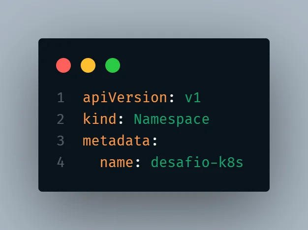
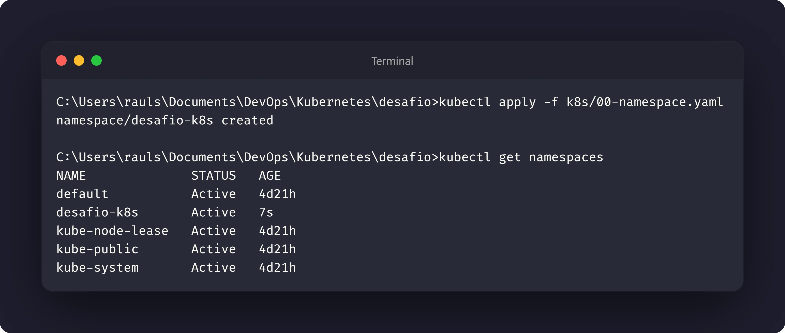
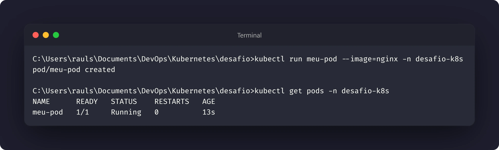
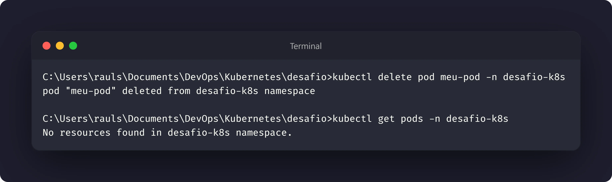

# Nível 1: Namespace e primeiro contato

## Objetivo

Criar um `Namespace` próprio para o desafio, executar um `Pod` de teste e observar
seu ciclo de vida. A atividade cobre a criação, a inspeção e a exclusão de um Pod
avulso.

Manifesto utilizado: [00-namespace.yaml](../k8s/00-namespace.yaml)

## Execução

O Namespace foi criado com o manifesto de referência:

```bash
kubectl apply -f k8s/00-namespace.yaml
kubectl get namespace desafio-k8s
```

Em seguida, foi iniciado um Pod temporário no Namespace do desafio:

```bash
kubectl run meu-pod --image=nginx -n desafio-k8s
```

## Inspeção

O estado, os detalhes, os eventos e os logs foram consultados com:

```bash
kubectl get pod meu-pod -n desafio-k8s
kubectl describe pod meu-pod -n desafio-k8s
kubectl get events -n desafio-k8s --sort-by=.lastTimestamp
kubectl logs meu-pod -n desafio-k8s
```

## Exclusão e conclusão

Após a inspeção, o Pod foi excluído:

```bash
kubectl delete pod meu-pod -n desafio-k8s
kubectl get pod meu-pod -n desafio-k8s
```

## Evidências










## Reflexão proposta

O Pod **não volta sozinho**. Como ele foi criado diretamente, não existe um
controlador responsável por comparar o estado atual com um estado desejado e
recriá-lo. Um `Deployment`, por exemplo, mantém seus Pods por meio de um
`ReplicaSet`; por isso, em ambientes reais, normalmente criamos Pods por meio
de controladores em vez de gerenciá-los diretamente.