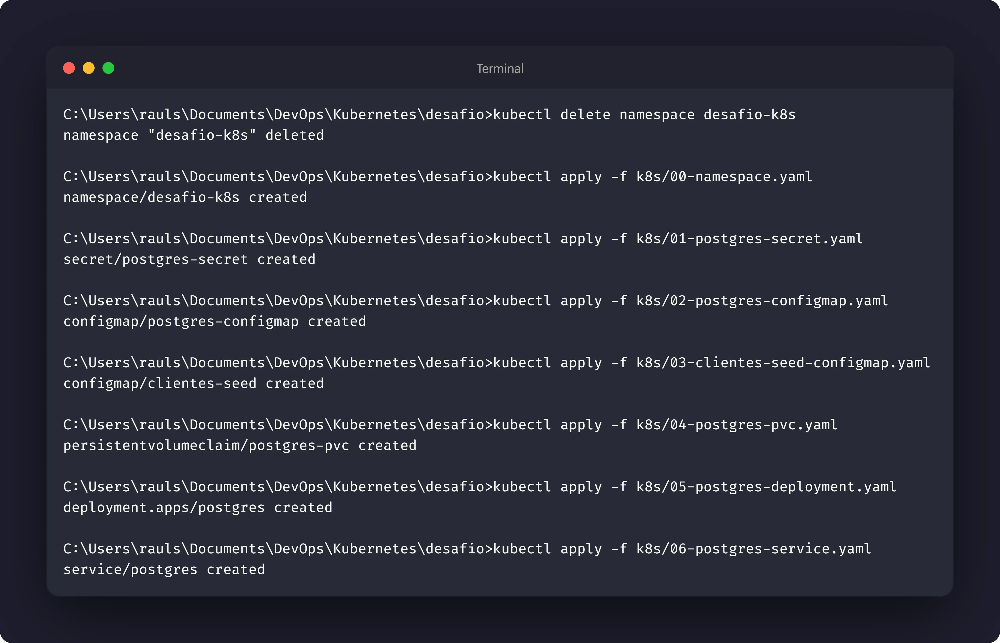
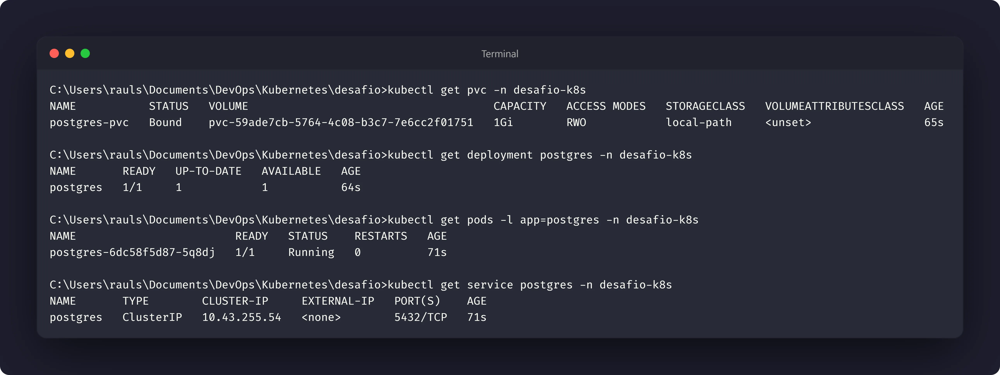
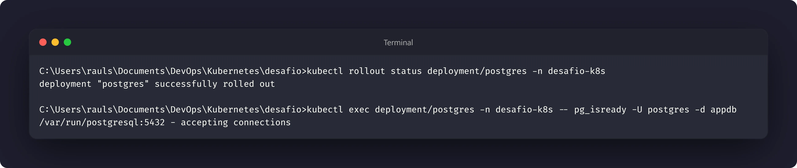
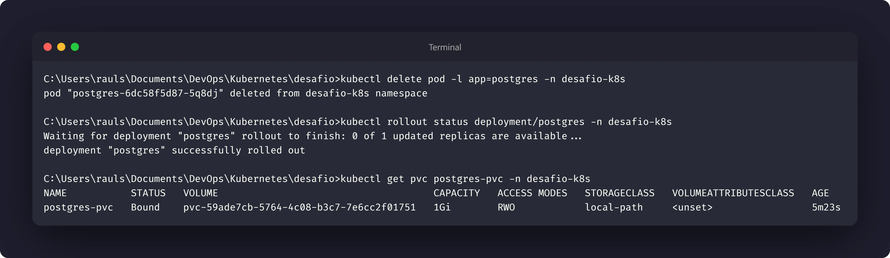

# Nível 2: Banco de dados com persistência

## Objetivo

Implantar o PostgreSQL no cluster com armazenamento persistente e disponibilizá-lo
por meio de um `Service` interno. O objetivo é garantir que os dados sobrevivam à
recriação do Pod e que outros recursos possam encontrar o banco pelo nome
`postgres`.

## Manifestos

- [01-postgres-secret.yaml.example](../k8s/01-postgres-secret.yaml.example)
- [02-postgres-configmap.yaml](../k8s/02-postgres-configmap.yaml)
- [03-clientes-seed-configmap.yaml](../k8s/03-clientes-seed-configmap.yaml)
- [04-postgres-pvc.yaml](../k8s/04-postgres-pvc.yaml)
- [05-postgres-deployment.yaml](../k8s/05-postgres-deployment.yaml)
- [06-postgres-service.yaml](../k8s/06-postgres-service.yaml)

## Observação importante

Os manifestos de configuração e seed serão aprofundados em níveis posteriores,
mas já são necessários para que o Deployment seja criado corretamente. O Secret
deve ser criado a partir do arquivo `.example`, com valores próprios para o
ambiente.

## Execução

Com o Namespace e as configurações do banco já disponíveis, os recursos foram
aplicados na seguinte ordem (considerando o Namespace criado no nível anterior):

```bash
kubectl apply -f k8s/01-postgres-secret.yaml
kubectl apply -f k8s/02-postgres-configmap.yaml
kubectl apply -f k8s/03-clientes-seed-configmap.yaml
kubectl apply -f k8s/04-postgres-pvc.yaml
kubectl apply -f k8s/05-postgres-deployment.yaml
kubectl apply -f k8s/06-postgres-service.yaml
```

O Deployment utiliza a imagem `postgres:16-alpine` e monta o PVC no diretório de
dados padrão do PostgreSQL. O Service recebe o nome `postgres` e, por ser um
`ClusterIP`, fica acessível somente dentro do cluster.

## Inspeção

O estado do armazenamento, do Deployment, do Pod e do Service foi verificado
com:

```bash
kubectl get pvc -n desafio-k8s
kubectl get deployment postgres -n desafio-k8s
kubectl get pods -l app=postgres -n desafio-k8s
kubectl get service postgres -n desafio-k8s
kubectl describe pvc postgres-pvc -n desafio-k8s
kubectl describe pod -l app=postgres -n desafio-k8s
```

Para confirmar que o PostgreSQL está pronto:

```bash
kubectl rollout status deployment/postgres -n desafio-k8s
kubectl exec deployment/postgres -n desafio-k8s -- \
  pg_isready -U postgres -d appdb
```

As probes de readiness e liveness do Deployment também usam `pg_isready` para
verificar a disponibilidade do banco.

## Persistência

A persistência pode ser demonstrada recriando o Pod gerenciado pelo Deployment:

```bash
kubectl delete pod -l app=postgres -n desafio-k8s
kubectl rollout status deployment/postgres -n desafio-k8s
kubectl get pvc postgres-pvc -n desafio-k8s
```

O Pod antigo é substituído por outro, mas o `postgres-pvc` permanece associado
ao workload. Como o diretório `/var/lib/postgresql/data` está montado no PVC, os
dados gravados no volume continuam disponíveis após a recriação.

## Evidências

As evidências deste nível devem registrar:







## Reflexão proposta

A diferença principal é o ciclo de vida dos dados:

| Recurso | Ciclo de vida | Resultado ao excluir o Pod |
| --- | --- | --- |
| `PersistentVolumeClaim` | Independente do Pod, conforme a política de retenção do volume | Os dados permanecem no volume e podem ser montados pelo novo Pod |
| `emptyDir` | Limitado ao ciclo de vida do Pod | O diretório e todo o seu conteúdo são removidos |

Portanto, `emptyDir` é adequado para dados temporários compartilhados entre
contêineres do mesmo Pod. Para os dados do PostgreSQL, é necessário um
`PersistentVolumeClaim`, pois o banco precisa sobreviver à recriação do Pod.
