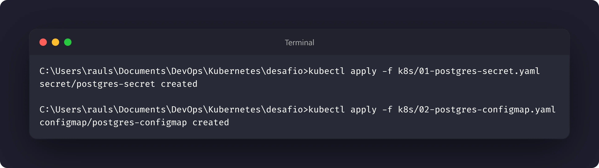
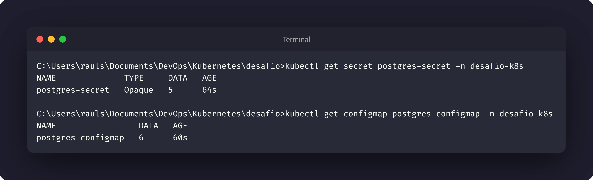
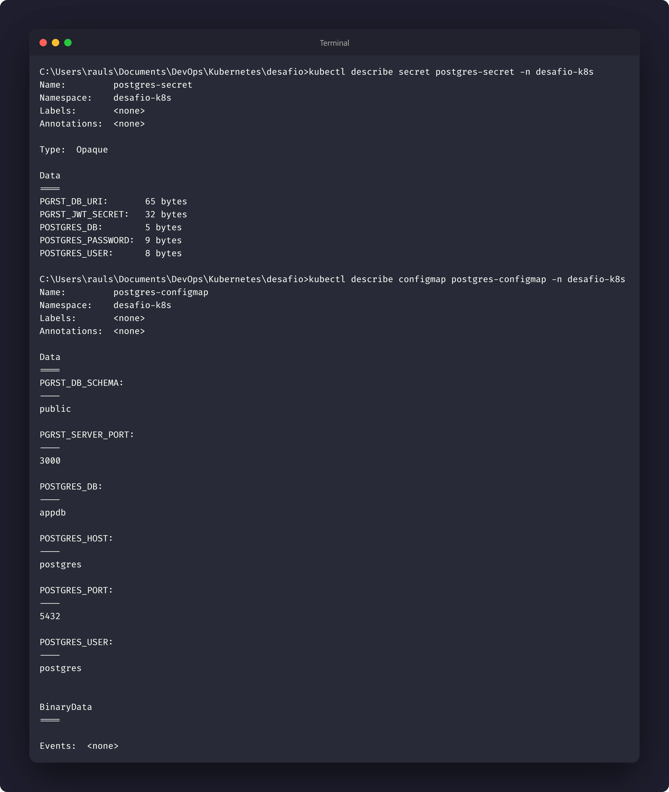

# Nível 3: Configuração e segredos

## Objetivo

Externalizar as configurações do PostgreSQL e proteger suas credenciais. Os
valores sensíveis são armazenados em um `Secret`, enquanto as configurações não
sensíveis ficam em um `ConfigMap`.

O mesmo `Secret` será reutilizado pela API nos níveis seguintes, sem que a senha
ou a chave JWT precisem ser escritas diretamente nos manifestos das aplicações.

## Manifestos

- [01-postgres-secret.yaml.example](../k8s/01-postgres-secret.yaml.example)
- [02-postgres-configmap.yaml](../k8s/02-postgres-configmap.yaml)

## Separação das configurações

O `Secret` contém os valores sensíveis do ambiente:

- `POSTGRES_PASSWORD`: Senha do seu PostgreSQL;
- `PGRST_DB_URI`: URI que inclui a senha de conexão no PostgREST;
- `PGRST_JWT_SECRET`: Token JWT do PostgREST (que será usado em níveis posteriores).

O `ConfigMap` contém valores de configuração que não são segredos:

- Nome do banco e Usuário;
- Host e Porta do PostgreSQL;
- Schema e Porta do PostgREST.

## Uso posterior no Deployment

Nos níveis seguintes, um Deployment poderá importar os valores dos dois recursos
com `envFrom`:

```yaml
envFrom:
  - configMapRef:
      name: postgres-configmap
  - secretRef:
      name: postgres-secret
```

Assim, o contêiner receberá as variáveis de ambiente sem que elas precisem ser
repetidas no manifesto da aplicação. Essa integração não faz parte da execução
deste nível.

## Execução

Crie uma cópia local do modelo do Secret, substitua os valores de preenchimento
e aplique somente os recursos deste nível:

```bash
copy k8s\01-postgres-secret.yaml.example k8s\01-postgres-secret.yaml
kubectl apply -f k8s/01-postgres-secret.yaml
kubectl apply -f k8s/02-postgres-configmap.yaml
```

Em ambientes Linux ou macOS:

```bash
cp k8s/01-postgres-secret.yaml.example k8s/01-postgres-secret.yaml
kubectl apply -f k8s/01-postgres-secret.yaml
kubectl apply -f k8s/02-postgres-configmap.yaml
```

## Inspeção

Verifique a existência dos recursos:

```bash
kubectl get secret postgres-secret -n desafio-k8s
kubectl get configmap postgres-configmap -n desafio-k8s
```

Para confirmar quais chaves existem sem exibir os valores:

```bash
kubectl describe secret postgres-secret -n desafio-k8s
kubectl describe configmap postgres-configmap -n desafio-k8s
```

## Evidências





## Reflexão proposta

Ao executar:

```bash
kubectl get secret postgres-secret -n desafio-k8s -o yaml
```

os valores aparecem no campo `data` em Base64. Isso **não é criptografia**: Base64
é apenas uma codificação reversível, que pode ser decodificada por qualquer
pessoa que obtenha o conteúdo.

O `Secret` melhora a organização e a forma como o Kubernetes distribui os
valores sensíveis, mas não deve ser tratado como proteção suficiente por si só.
A segurança real também depende do controle de acesso ao cluster, das permissões
RBAC, da proteção do etcd e do gerenciamento adequado dos arquivos e logs que
podem conter essas credenciais.
