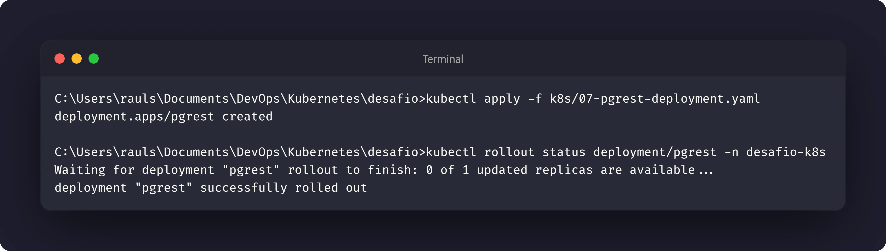
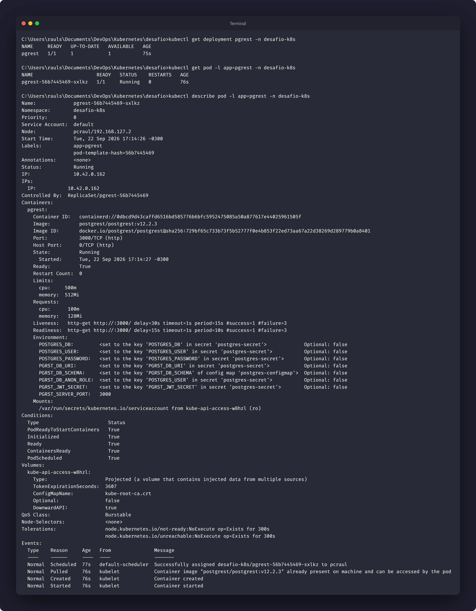
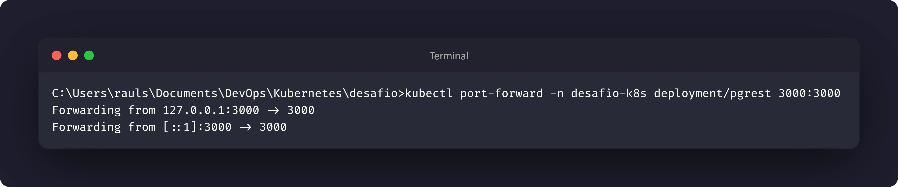
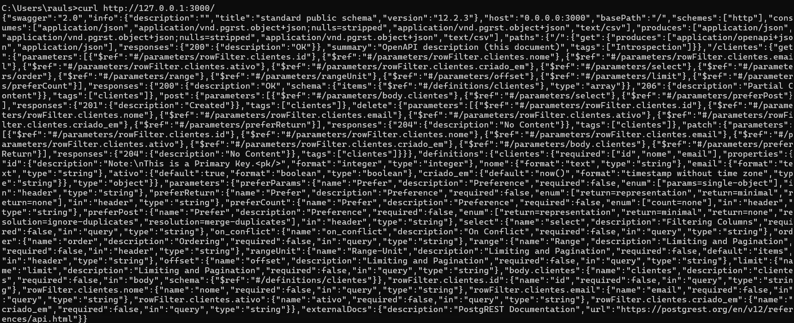
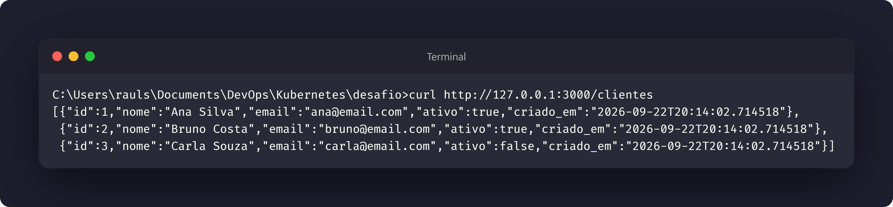

# Nível 4: A API conectada ao banco

## Objetivo

Implantar o PostgREST como uma API que se conecta ao PostgreSQL pelo nome do
`Service` interno, e não pelo IP de um Pod. A integração será validada criando
uma tabela no banco e consultando essa tabela por HTTP.

## Manifestos

- [01-postgres-secret.yaml.example](../k8s/01-postgres-secret.yaml.example)
- [02-postgres-configmap.yaml](../k8s/02-postgres-configmap.yaml)
- [07-pgrest-deployment.yaml](../k8s/07-pgrest-deployment.yaml)

O PostgreSQL e o Service `postgres` devem estar disponíveis desde os níveis
anteriores.

## Configuração da API

O Deployment do PostgREST usa `valueFrom` para obter os valores dos recursos de
configuração:

- `secretKeyRef` para credenciais, URI do banco e chave JWT;
- `configMapKeyRef` para o schema da API;
- valor direto para a porta HTTP do PostgREST.

A URI de conexão aponta para `postgres:5432`. Esse nome é resolvido pelo DNS
interno do Kubernetes para o Service do banco.

## Execução

Aplique o Deployment da API:

```bash
kubectl apply -f k8s/07-pgrest-deployment.yaml
kubectl rollout status deployment/pgrest -n desafio-k8s
```

Confirme que o Pod da API está pronto:

```bash
kubectl get deployment pgrest -n desafio-k8s
kubectl get pod -l app=pgrest -n desafio-k8s
kubectl describe pod -l app=pgrest -n desafio-k8s
```

## Criar a tabela

O seed do PostgreSQL cria a tabela `clientes` quando o diretório de dados é
inicializado pela primeira vez. Para conferir a estrutura pela API, faça uma
requisição de leitura:

```bash
kubectl port-forward -n desafio-k8s deployment/pgrest 3000:3000
```

Em outro terminal:

```bash
curl http://127.0.0.1:3000/
curl http://127.0.0.1:3000/clientes
```

A resposta de `/clientes` confirma que o PostgREST encontrou o banco, carregou o
schema `public` e expôs a tabela por HTTP.

## Evidências







## Reflexão proposta

Usar `postgres` na string de conexão é mais resiliente do que usar o IP de um
Pod. O Service mantém um endereço DNS estável e encaminha o tráfego para os
Pods selecionados. Se o Pod do banco for recriado e receber outro IP, a API
continua apontando para o mesmo nome.
