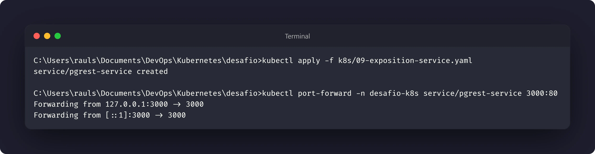
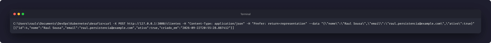
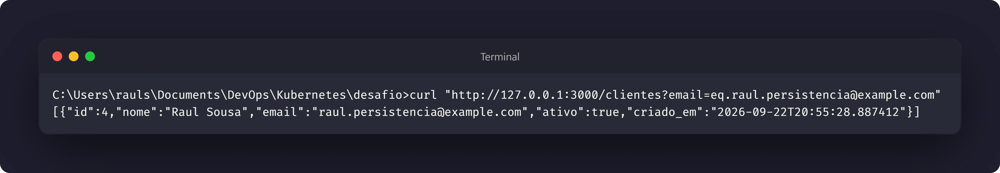
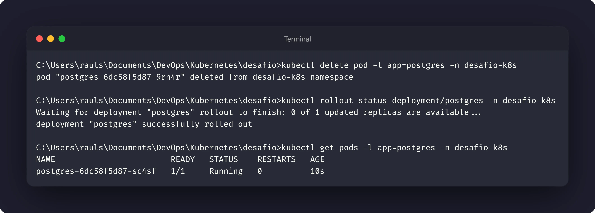

# Nível 5: Expor a API e provar a persistência

## Objetivo

Expor temporariamente a API para a máquina local, inserir um registro por HTTP,
consultá-lo e depois comprovar que ele continua disponível após a recriação do
Pod do PostgreSQL.

O critério de sucesso é recuperar, depois da recriação, o mesmo registro criado
antes dela.

## Pré-requisitos

Os recursos dos níveis anteriores devem estar disponíveis:

- PostgreSQL gerenciado pelo Deployment `postgres`;
- dados montados no `postgres-pvc`;
- PostgREST no Deployment `pgrest`;
- Service `pgrest-service` criado.

Manifesto da exposição: [09-exposition-service.yaml](../k8s/09-exposition-service.yaml)

## Exposição local

O Service da API é exposto localmente com `port-forward`:

```bash
kubectl apply -f k8s/09-exposition-service.yaml
kubectl port-forward -n desafio-k8s service/pgrest-service 3000:80
```

Mantenha esse comando executando e use outro terminal para as requisições.

## Inserção e leitura

Insira um registro com um e-mail único e consulte a resposta da API:

```bash
curl -X POST http://127.0.0.1:3000/clientes \
  -H "Content-Type: application/json" \
  -H "Prefer: return=representation" \
  --data '{"nome":"Raul Sousa","email":"raul.persistencia@example.com","ativo":true}'

curl "http://127.0.0.1:3000/clientes?email=eq.raul.persistencia@example.com"
```

Guarde a resposta ou o identificador do registro para comparar depois.

## Recriação do PostgreSQL

Exclua apenas o Pod do banco. O Deployment deverá criar outro Pod:

```bash
kubectl delete pod -l app=postgres -n desafio-k8s
kubectl rollout status deployment/postgres -n desafio-k8s
kubectl get pods -l app=postgres -n desafio-k8s
```

Consulte o registro novamente pela mesma API:

```bash
curl "http://127.0.0.1:3000/clientes?email=eq.raul.persistencia@example.com"
```

O registro deve continuar acessível. Isso demonstra que o Pod foi recriado, mas
os dados permaneceram no `postgres-pvc` montado em `/var/lib/postgresql/data`.

## Evidências







## Reflexão proposta

O resultado depende da coordenação entre PVC, Deployment, Service, Secret e
API. O Deployment recria o Pod, o PVC preserva os dados, o Service mantém o
endereço de acesso e a API continua consultando o banco pelo nome do Service.

Se o registro desaparecer, verifique primeiro se o volume correto está montado
e se o banco foi inicializado novamente sem o PVC esperado.
