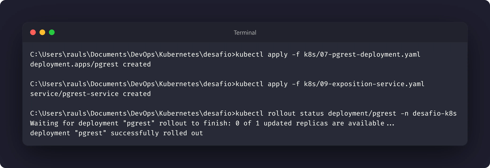
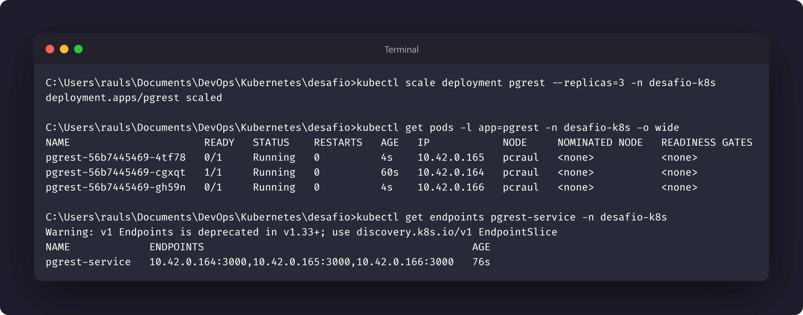
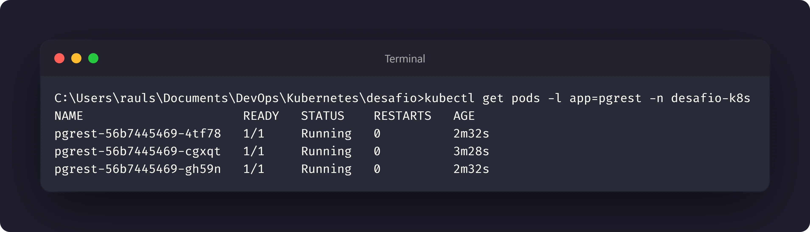

# Nível 6: Health checks e escala

## Objetivo

Configurar o Kubernetes para identificar quando a API está saudável, quando está
pronta para receber tráfego e quanto CPU e memória devem ser reservados para
cada réplica. Depois, aumentar o número de réplicas e observar o Service
balancear as requisições.

## Manifesto

- [07-pgrest-deployment.yaml](../k8s/07-pgrest-deployment.yaml)
- [09-exposition-service.yaml](../k8s/09-exposition-service.yaml)

## Probes

O Deployment `pgrest` utiliza duas probes HTTP na porta 3000 e no caminho `/`:

- `readinessProbe`: controla quando o Pod pode receber tráfego;
- `livenessProbe`: indica quando o contêiner precisa ser reiniciado.

A readiness começa após 15 segundos e é verificada a cada 10 segundos. A
liveness começa após 30 segundos e é verificada a cada 15 segundos.

## Recursos

Cada réplica da API declara:

| Recurso | Request | Limit |
| --- | --- | --- |
| CPU | `100m` | `500m` |
| Memória | `128Mi` | `512Mi` |

Os requests participam do agendamento e os limits restringem o consumo máximo
do contêiner.

## Execução

Aplique o Deployment e o Service da API:

```bash
kubectl apply -f k8s/07-pgrest-deployment.yaml
kubectl apply -f k8s/09-exposition-service.yaml
kubectl rollout status deployment/pgrest -n desafio-k8s
```

Aumente o número de réplicas para observar a distribuição:

```bash
kubectl scale deployment pgrest --replicas=3 -n desafio-k8s
kubectl get pods -l app=pgrest -n desafio-k8s -o wide
kubectl get endpoints pgrest-service -n desafio-k8s
```

O Service `pgrest-service` seleciona os Pods pelo label `app: pgrest` e encaminha
as requisições para a porta 3000. O Service é exposto na porta 80.

## Verificação

Abra um acesso local e consulte a API:

```bash
kubectl port-forward -n desafio-k8s service/pgrest-service 3000:80
curl http://127.0.0.1:3000/clientes
```

Consulte as condições dos Pods e os eventos de saúde:

```bash
kubectl describe pods -l app=pgrest -n desafio-k8s
kubectl get pods -l app=pgrest -n desafio-k8s
```

## Evidências

Registre:






## Reflexão proposta

Readiness e liveness têm efeitos diferentes: a readiness retira um Pod não
pronto dos endpoints, enquanto a liveness permite que o kubelet reinicie um
contêiner que deixou de responder corretamente.

Escalar a API é seguro porque as réplicas são stateless e compartilham o mesmo
banco. Escalar o PostgreSQL da mesma forma, com várias réplicas escrevendo no
mesmo PVC, não é seguro sem uma arquitetura específica de replicação e
coordenação.
