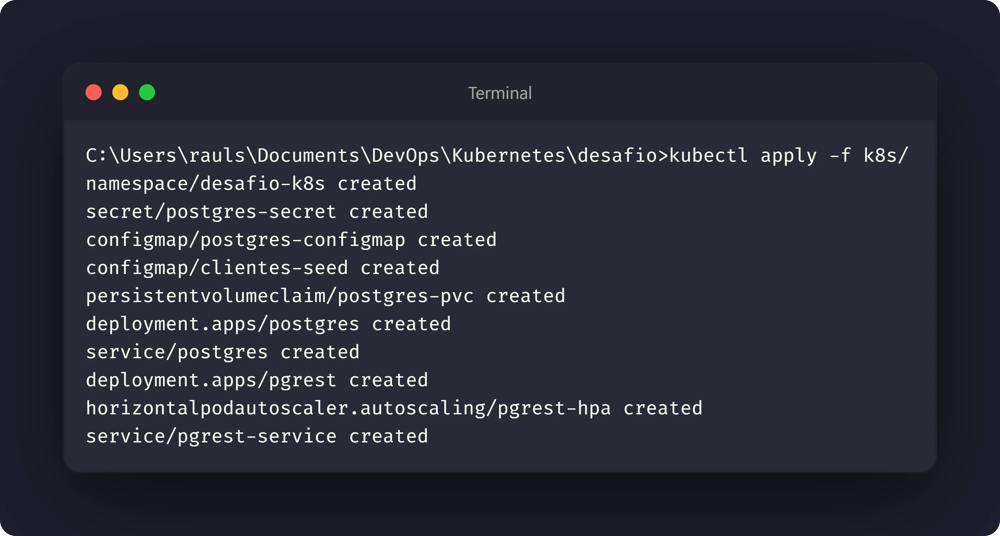
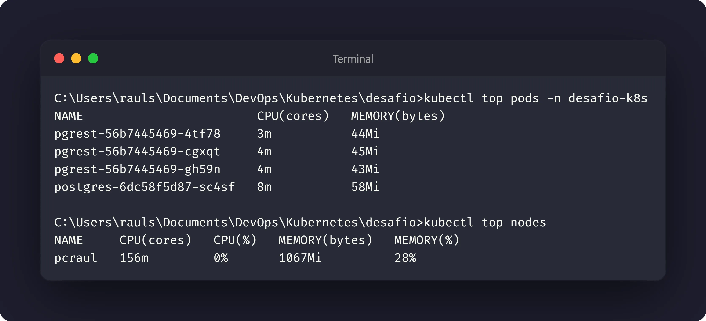
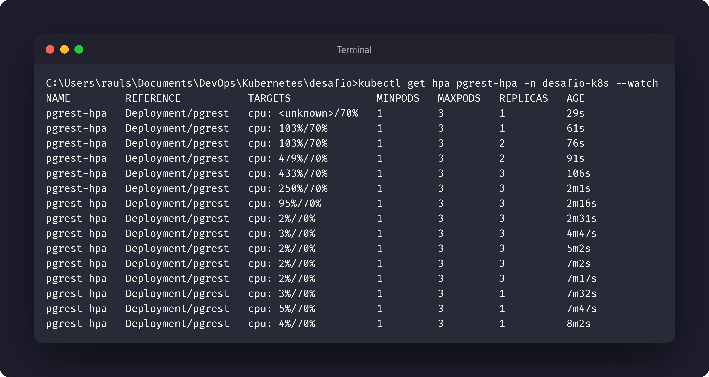
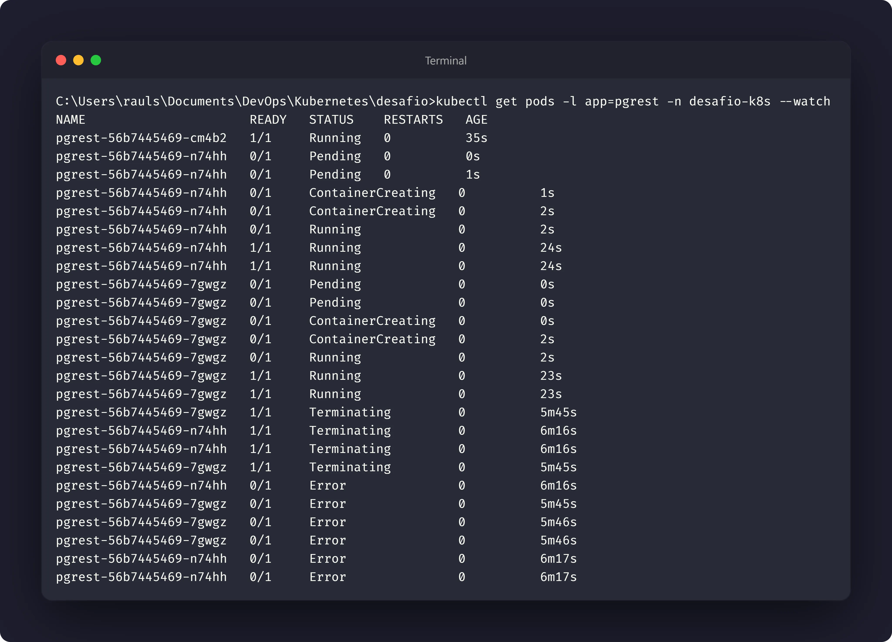

# Nível 7: Escalonamento automático

## Objetivo

Configurar um `HorizontalPodAutoscaler` para aumentar ou reduzir
automaticamente as réplicas da API conforme o uso de CPU. O cluster deve ter o
Metrics Server disponível para fornecer as métricas usadas pelo HPA.

## Manifestos

- [07-pgrest-deployment.yaml](../k8s/07-pgrest-deployment.yaml)
- [08-pgrest-hpa.yaml](../k8s/08-pgrest-hpa.yaml)

O HPA escala o Deployment `pgrest` de 1 a 3 réplicas e usa 70% de utilização
média de CPU como alvo.

## Pré-requisito: Metrics Server

Verifique se o cluster consegue fornecer métricas:

```bash
kubectl top pods -n desafio-k8s
kubectl top nodes
```

Se esses comandos não retornarem métricas, o HPA não conseguirá tomar decisões.
Instale ou habilite o Metrics Server conforme a ferramenta local do cluster.

## Execução

Aplique o Deployment e o HPA (ou todo o projeto com um único comando:):

```bash
kubectl apply -f k8s/
```

Acompanhe o HPA e as réplicas:

```bash
kubectl get hpa pgrest-hpa -n desafio-k8s --watch
kubectl get pods -l app=pgrest -n desafio-k8s --watch
```

## Geração de carga

Com o Service acessível localmente, abra o encaminhamento:

```bash
kubectl port-forward -n desafio-k8s service/pgrest-service 3000:80
```

Em outro terminal PowerShell, gere requisições concorrentes até o HPA atingir
as 3 réplicas. Os jobs são encerrados automaticamente ao final:

```powershell
$jobs = 1..20 | ForEach-Object {
	Start-Job -ScriptBlock {
		while ($true) {
			try {
				Invoke-WebRequest -UseBasicParsing http://127.0.0.1:3000/clientes | Out-Null
			} catch {
				# Mantém o worker ativo durante reinícios ou alterações de pods.
			}
		}
	}
}

try {
	do {
		kubectl get deployment pgrest -n desafio-k8s
		Start-Sleep -Seconds 5
		$replicas = kubectl get deployment pgrest -n desafio-k8s -o jsonpath='{.status.availableReplicas}'
	} while ([int]$replicas -lt 3)
} finally {
	$jobs | Stop-Job
	$jobs | Remove-Job
}
```

Em Linux ou macOS, uma alternativa é:

```bash
for i in $(seq 1 300); do curl -s http://127.0.0.1:3000/clientes > /dev/null; done
```

Observe o uso de CPU e o número de réplicas durante a carga:

```bash
kubectl top pods -l app=pgrest -n desafio-k8s
kubectl get hpa pgrest-hpa -n desafio-k8s
kubectl get deployment pgrest -n desafio-k8s
```

Quando a carga cair, o HPA poderá reduzir as réplicas até o mínimo configurado.

## Evidências






## Reflexão proposta

O HPA depende dos requests de CPU definidos no Deployment para calcular a
utilização. Escalar a API é apropriado porque cada réplica pode atender
requisições de forma independente. O banco não deve ser escalado desse modo com
o mesmo PVC, pois várias instâncias escrevendo no mesmo volume podem corromper
os dados ou produzir conflitos.
